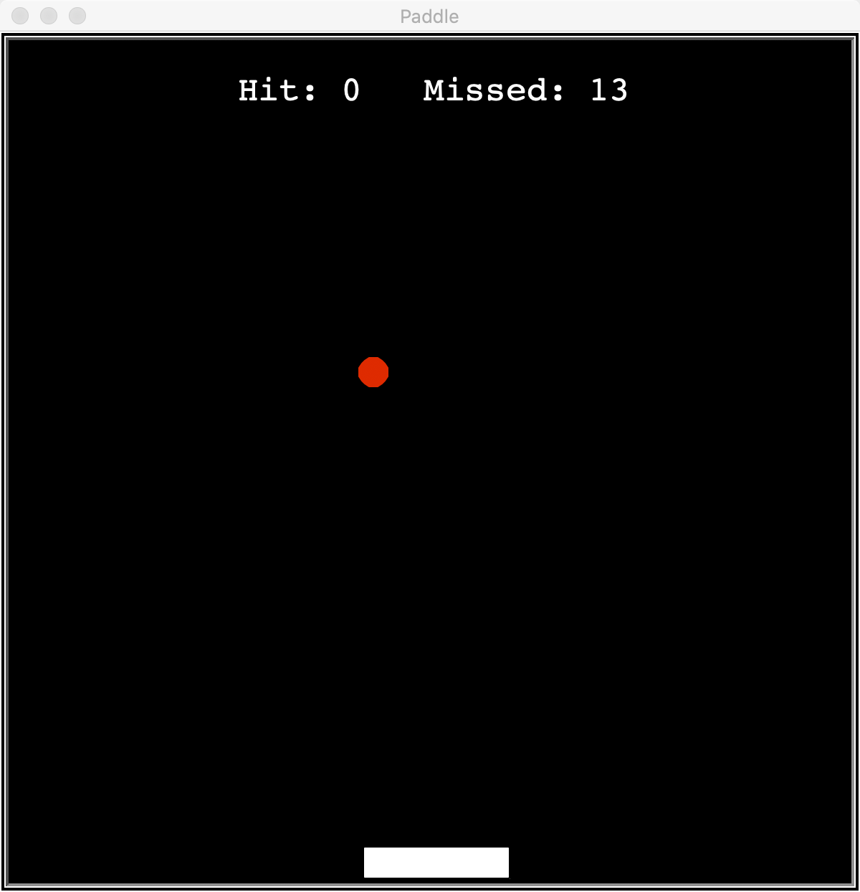

# PaddleGame

## Paddle.py
The actual game which can be played by human or AI.

## PaddleEnv.py
The paddle game environment which defines the state and reward.

Action space: there is only three spaces (paddle going left, paddle going right, no movement)

Observation space: observation of the current environment (current location of the ball, 
current location of the paddle, x-coordinate difference between the ball and paddle).

Reward: if paddle hit the ball, get 10 points. If paddle miss the ball, get -10 points. Extra movement will cost 0.01 points

## train.py
The training of the game using Deep Q Network.

## Remark
Stable baseline is inefficient for training reinforcement learning environment.
